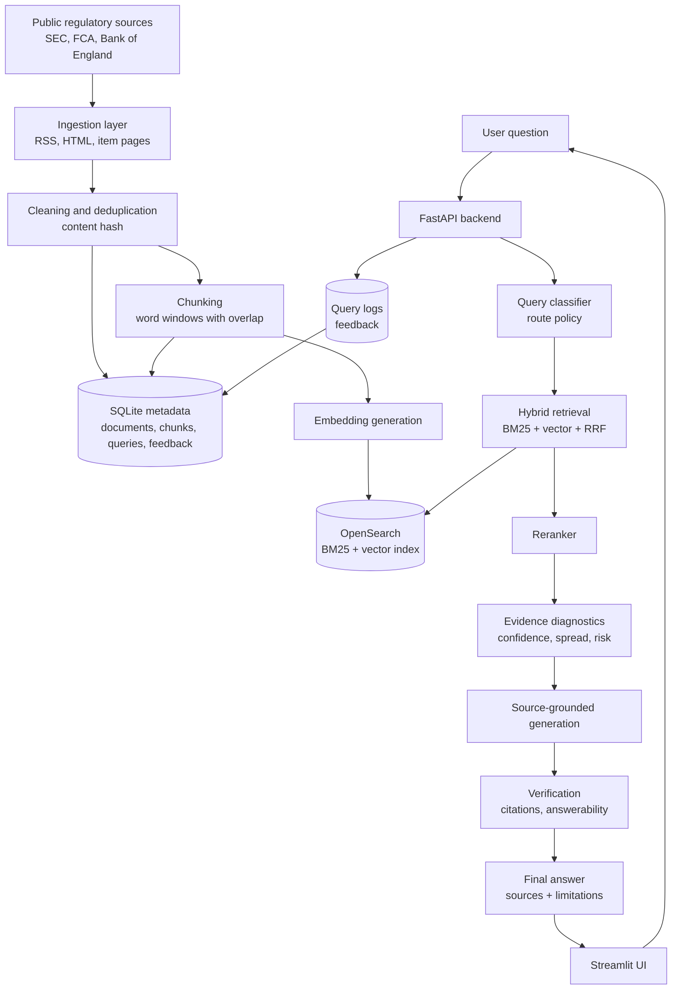
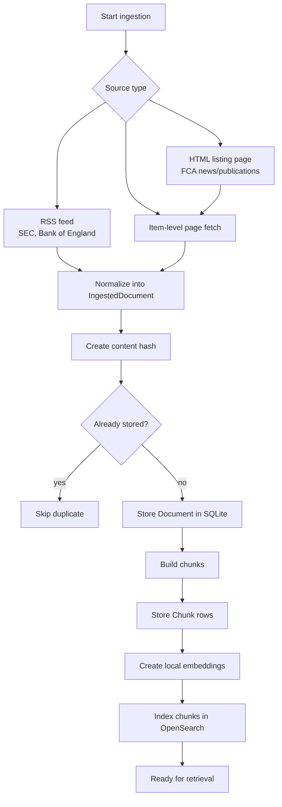
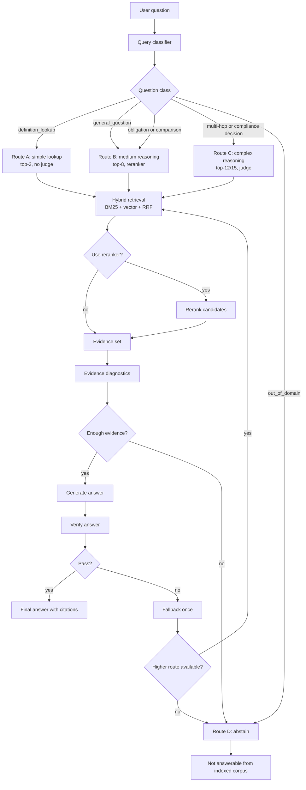
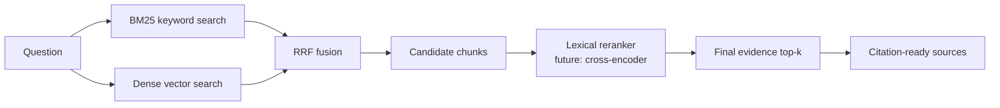
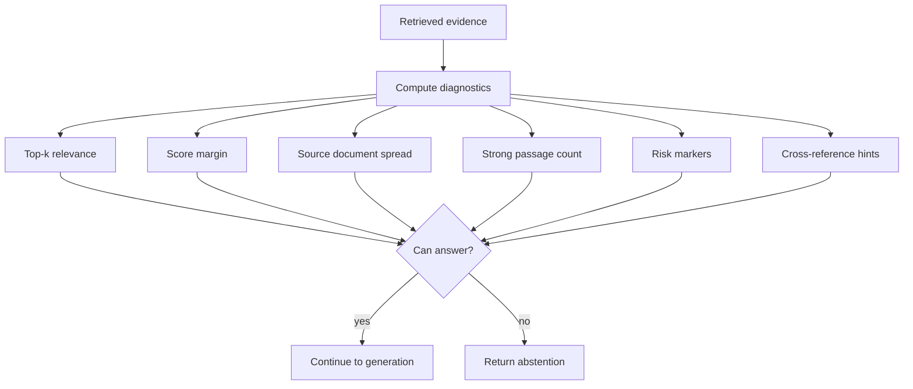
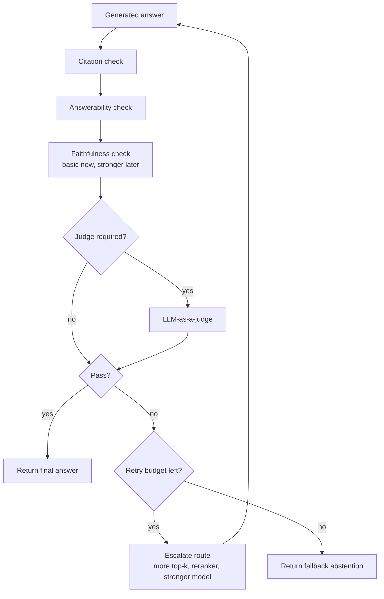
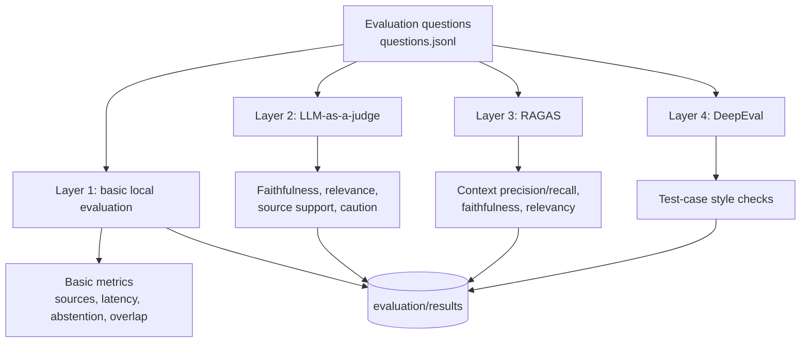
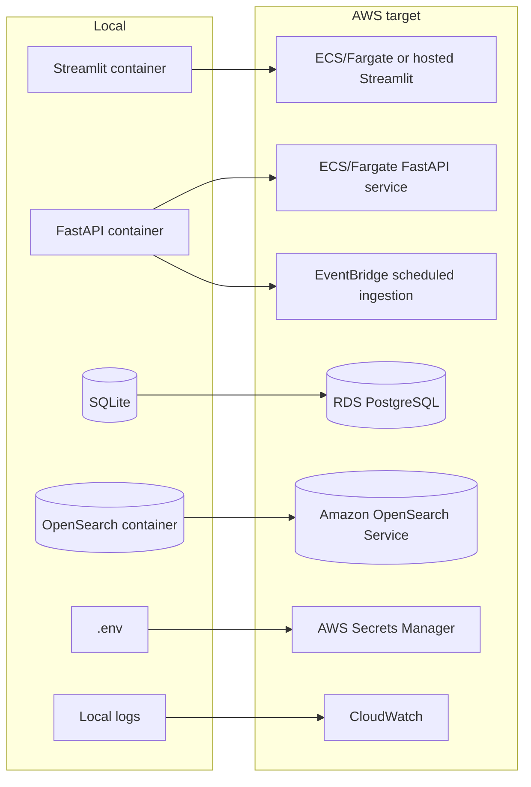

# FinReg Live Intelligence Architecture

This document shows the system architecture with diagrams. The main README
explains the project plan; this file focuses on how the parts connect.

## 1. General Architecture

## 2. Ingestion and Indexing Pipeline

## 3. Route-Aware Query Pipeline

## 4. Retrieval and Reranking Detail

## 5. Evidence Diagnostics and Abstention

## 6. Verification and Fallback

## 7. Evaluation Architecture

## 8. Local to Cloud Mapping

